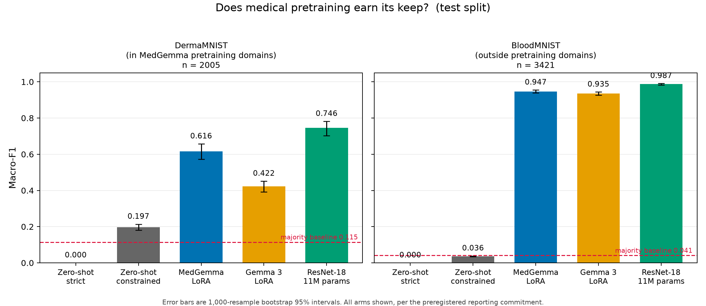
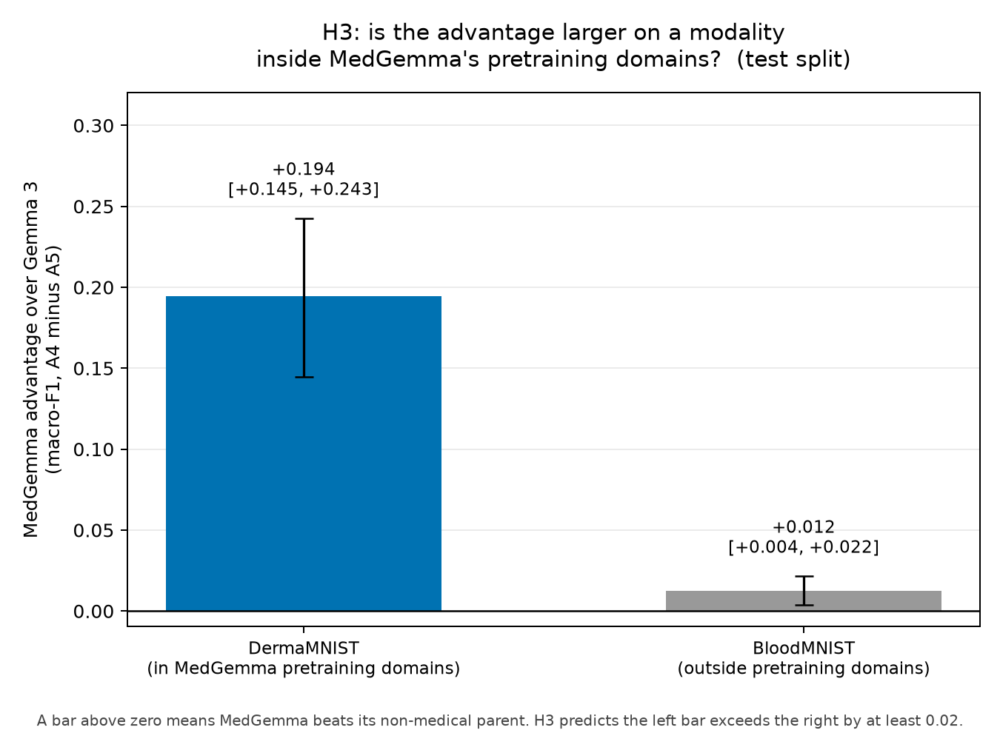

# Does medical pretraining earn its keep?

A controlled evaluation of MedGemma 1.5 4B against its non-medical parent and
a ResNet-18, with every prediction registered before any model was run.

---

## The finding

**Medical pretraining does real, measurable, modality-specific work, and it
does not make a 4B vision-language model competitive with a small CNN.**

After identical LoRA fine-tuning on identical data, MedGemma 1.5 4B beats
Gemma 3 4B by **+0.195 macro-F1** on dermatoscopic images, a modality inside
its stated pretraining domains, and by **+0.012** on blood cell microscopy,
which is outside them. That gap between the gaps, **+0.182 with a 95 percent
interval of [+0.133, +0.228]**, is the study's primary result: the advantage
tracks what the encoder was trained on.

A second finding concerns how such models are usually measured. Evaluated
zero-shot with strict parsing, the method used in widely circulated
tutorials, MedGemma scores **0.000 on both datasets**. It produced a bare
canonical label **zero times in 5,426 test images**, always wrapping the
answer in prose. The rate is 100 percent on validation as well, 2,715 of
2,715. Removing that measurement artifact recovers 0.197 on DermaMNIST,
about a third of the apparent gain from fine-tuning.

The third finding is the least comfortable. A **ResNet-18 with 11.2M
parameters**, trained for three minutes, beats both 4B models on **both**
datasets, by 13.0 and 4.0 points, at **387x fewer parameters**.

**Preregistration:** [`HYPOTHESES.md`](HYPOTHESES.md), frozen at commit
`41a958a`, **2026-07-25 02:28:40 UTC**, before any model produced a
prediction. Everything after that is in [`DEVIATIONS.md`](DEVIATIONS.md),
append only, including corrections to my own earlier claims.

One commit touched `HYPOTHESES.md` after the freeze: `8f5e151` replaced the
placeholder on the `Date registered:` line with the commit's actual
timestamp. No hypothesis, threshold, metric, or analysis rule was changed.
`git log -p -- HYPOTHESES.md` shows the full history in two commits.

---

## Results

Macro-F1 on the held-out test split, evaluated once, after every arm was
complete. DermaMNIST n = 2,005, BloodMNIST n = 3,421. Intervals are
1,000-resample percentile bootstraps.

| Arm | Treatment | DermaMNIST | BloodMNIST |
|---|---|---|---|
| A1 | zero-shot, strict parsing | 0.000 [0.000, 0.000] | 0.000 [0.000, 0.000] |
| A2 | zero-shot, lenient parsing | 0.165 [0.130, 0.198] | 0.039 [0.035, 0.043] |
| A2b | zero-shot, answer extraction *(exploratory)* | 0.367 [0.331, 0.403] | 0.038 [0.035, 0.042] |
| A3 | zero-shot, constrained decoding | 0.197 [0.181, 0.214] | 0.036 [0.034, 0.038] |
| A4 | **MedGemma 1.5 4B, LoRA** | **0.617 [0.573, 0.657]** | **0.947 [0.939, 0.955]** |
| A5 | Gemma 3 4B IT, LoRA *(control)* | 0.422 [0.392, 0.451] | 0.935 [0.926, 0.944] |
| A6 | **ResNet-18, 11.2M parameters** | **0.746 [0.702, 0.782]** | **0.987 [0.983, 0.991]** |
| | majority-class baseline | 0.115 | 0.041 |



A4 and A5 differ **only in starting weights**. Identical LoRA rank, alpha,
dropout, target modules, learning rate, epochs, batch size, gradient
accumulation, seed, and the same 5,000 training images verified by SHA-256.
Wall-clock training time differed by 0.3 minutes across all four runs.

---

## Hypotheses

Each was stated in advance with its falsification condition, and all are
reported regardless of outcome.

### H1, format artifact — split verdict

*Constrained decoding raises macro-F1 by at least 10 points over strict
parsing on both datasets, with over 20 percent unparseable under strict.*

| | A3 − A1 | 95% CI | Verdict |
|---|---|---|---|
| DermaMNIST | **+0.197** | [+0.181, +0.214] | **holds** |
| BloodMNIST | **+0.036** | [+0.034, +0.038] | **falsified** |

The unparseable clause holds everywhere and by a wide margin: 100 percent
under strict parsing on both datasets, against the 20 percent predicted. The
magnitude clause fails on BloodMNIST.

**The corrected claim is narrower than the registered one.** Format artifacts
inflate measured error only where genuine capability is being obscured. They
cannot manufacture capability that is absent. H1 as written did not
distinguish these cases and should have.

### H2, medical pretraining — holds, with one caveat

*After LoRA, MedGemma beats Gemma 3 on both datasets, by 1 to 5 points.*

| | A4 − A5 | 95% CI | Verdict |
|---|---|---|---|
| DermaMNIST | **+0.195** | [+0.145, +0.243] | holds |
| BloodMNIST | **+0.012** | [+0.003, +0.021] | holds |

**The predicted range was wrong in both directions.** DermaMNIST came in at
19.5 points against a predicted ceiling of 5. BloodMNIST came in at 1.2
points, below the predicted floor. Registering a range rather than a
direction is what makes that visible.

**The BloodMNIST result should not be leaned on.** An incidental replication
during this project measured run-to-run variance at **0.008 macro-F1** under
a fixed seed (see D-013). At +0.012 this advantage is roughly 1.5x that
floor, and the interval's lower bound sits below it. The bootstrap quantifies
sampling uncertainty over the test set; it does not quantify variance from
retraining. Treat it as directionally consistent, not established.

### H3, modality interaction — primary test, holds

*The MedGemma advantage is larger on DermaMNIST, inside its stated
image-encoder pretraining domains, than on BloodMNIST, outside them.
Predicted difference at least 2 points.*

| | Value | 95% CI | Verdict |
|---|---|---|---|
| (A4 − A5) Derma − (A4 − A5) Blood | **+0.182** | [+0.133, +0.228] | **holds** |



Measured effect is 9x the registered threshold, with an interval clearing
zero comfortably. The same interaction on the validation split was +0.118
[+0.050, +0.184], so the direction and significance replicate across splits
while the magnitude does not.

### H4, parameter efficiency — holds, more strongly than predicted

*ResNet-18 lands within 5 points of the better 4B model on both datasets and
beats it on at least one.*

| | A6 − A4 | 95% CI |
|---|---|---|
| DermaMNIST | **+0.130** | [+0.075, +0.181] |
| BloodMNIST | **+0.040** | [+0.033, +0.048] |

ResNet-18 beat the better 4B arm on **both** datasets, not one. Three
minutes of training against 38, and 387x fewer parameters.

**A tension in the registered wording worth naming.** The prediction had two
clauses: within 5 points on both datasets, and ahead on at least one. ResNet
beat A4 by 13.0 points on DermaMNIST, which is not within 5 points of it. The
"within 5" clause was written on the assumption that ResNet would *trail*,
and it is inapplicable in the direction the result actually went. H4 holds
under its registered falsification condition, which is that ResNet trails the
better 4B model by more than 5 points on both datasets. It does not trail at
all.

---

## What Q1 asked: how much was format, how much was learning

| | DermaMNIST | BloodMNIST |
|---|---|---|
| A1 strict, zero-shot | 0.000 | 0.000 |
| A3 constrained, format removed | 0.197 | 0.036 |
| A4 fine-tuned | 0.617 | 0.947 |
| **Format component** (A1→A3) | **+0.197 (32%)** | **+0.036 (4%)** |
| **Learned component** (A3→A4) | **+0.420 (68%)** | **+0.911 (96%)** |

After fine-tuning on bare labels, strict, lenient, and extraction parsing
return **identical macro-F1 to four decimal places** on both arms and both
datasets. The format penalty is eliminated, not reduced.

The A3→A4 component bundles medical discrimination with general task
adaptation, and this design cannot separate them. It is the *learned*
component, not the *medical* component: A5 gained substantially on the same
axis without any medical pretraining.

---

## Related work

**The MedGemma versus Gemma 3 comparison is established, and H2 replicates
it.** A controlled comparison at 4B scale on MedQA-USMLE found +6.8 points
from domain fine-tuning (arXiv:2604.23801), and a chest radiograph study
compared MedGemma 27B against Gemma 3 27B to separate size from domain
training (arXiv:2509.18015). H2 is included because H3 requires it: an
interaction test is meaningless without the main effect established on both
datasets.

**The parsing failure also has precedent, and this study tests the proposed
explanation.** Appendix F of arXiv:2605.13711 reports MedGemma-4B producing
unparseable output on 62.7 to 89.7 percent of items across four clinical
prediction tasks, against 0.0 percent for Qwen3-4B. Those authors suspect the
cause is that MedGemma's training is "primarily oriented toward medical image
understanding, with text supervision derived from relatively small medical QA
datasets."

If that were the whole story, the failure should be milder on images. It is
not. This study measures **100 percent unparseable on image classification**,
5,426 of 5,426 test images, the task type that explanation favours. Their response was to switch models;
this one changes the measurement.

**What appears to be new is H3.** Prior work compares MedGemma to Gemma
without asking whether the advantage tracks the encoder's stated pretraining
domains. This design holds the model pair, prompt, LoRA budget, training
subsample, and seed fixed, and varies only that.

---

## What this does not show

**Contamination.** MedMNIST+ is public and derived from public sources.
MedGemma may have encountered these images during pretraining. Google's model
card raises this risk and advises validating on non-public data, which was
not available here. Any MedGemma advantage may reflect memorization rather
than transferable representation, and this design cannot separate the two.

**The out-of-domain control is weaker than registered.** MedGemma 1.5's
encoder was trained on whole-slide histopathology, which is brightfield
microscopy of stained cells. So is a peripheral blood smear. BloodMNIST is a
modality not named in the pretraining list that nonetheless shares imaging
physics and staining conventions with one that is. This would be expected to
*shrink* the measured interaction rather than inflate it, but a weaker
contrast is a weaker test regardless of which way the bias runs. See D-014.

**Single seed.** One seed per arm. The only empirical estimate of run-to-run
variance is 0.008 macro-F1, measured on ResNet-18 rather than LoRA training.
H3 at +0.182 and H2-DermaMNIST at +0.195 are more than 20x that floor.
H2-BloodMNIST at +0.012 is not.

**Single prompt.** One template per dataset, fixed on validation data, no
prompt search. Google's model card notes MedGemma may be more prompt
sensitive than Gemma 3, so the effect size is prompt-conditional.

**Subsampled training.** 5,000 images per dataset. Absolute performance sits
below what full-data fine-tuning would reach. Between-arm comparisons remain
valid since all arms saw the identical subset.

**One architecture family.** MedGemma 1.5 4B and Gemma 3 4B IT share an
architecture, which is what makes the comparison clean, and also means the
findings may not generalize to other medically adapted models.

**Classification, not clinical utility.** A4 and A5 were fine-tuned to emit
bare labels, which makes them better at this task and worse at explaining
themselves. Nothing here measures clinical usefulness.

**Rare classes.** DermaMNIST classes 3 and 6 had 56 and 68 training examples
in the subsample. Per-class F1 is reported in `results/results.jsonl` rather
than hidden in the macro average.

---

## What was decided in advance, and why it mattered

**Macro-F1 was fixed as primary before any result existed.** On DermaMNIST,
A2b reaches 0.643 accuracy against a 0.669 majority baseline. Reported on
accuracy the model looks worse than a constant predictor; on macro-F1 it
scores triple the baseline. Choosing the metric afterward would have
permitted either story.

**The A3 normalization was prespecified as mean log-probability, and it is
the worst of the three variants tested.** It scores 0.197 against PMI at
0.345 on DermaMNIST. With the choice left open, PMI could have been the
headline and mean described as an alternative also considered. No reader
could have detected the substitution.

**Figure axes and arm inclusion were committed before the test numbers
existed** (commit `d3c9df1`). Y-axes start at zero, no arm is dropped for
underperforming, and every bar carries its interval. The A3 robustness
variants (`A3-sum`, `A3-pmi`) appear in the results table and in
`results/results.jsonl` rather than in the figure, which shows the
preregistered arms.

**The generation token cap was measured, not guessed.** A 50-image pilot
found output up to 433 tokens. A cap set by intuition would have truncated
answers, scored them unparseable, and manufactured the exact artifact H1 was
built to measure.

---

## Method

**Data.** MedMNIST+ at 224x224, official splits verbatim. Training subsampled
to 5,000 images per dataset at seed 42, drawn once and reused across A4, A5,
and A6. Index lists and their SHA-256 are in [`subsamples/`](subsamples/),
and the training scripts refuse to run on a hash mismatch.

**Models.** Pinned by revision, official repositories only.

```
google/medgemma-1.5-4b-it   91850547d9f0b2fdd21aa7c5f4f3d1a8a52c243b
google/gemma-3-4b-it        093f9f388b31de276ce2de164bdc2081324b9767
```

**LoRA.** Rank 16, alpha 32, dropout 0.05, applied to 238 language-model
projections. The vision encoder is frozen, verified by a trainable-parameter
count that halts the run if non-zero. This matters for H3: fine-tuning the
encoder would let both models learn the modality during training and wash out
the difference being tested. 29,802,496 trainable parameters, 0.688 percent.

**Parsing.** Three definitions fixed before any output was scored, in
[`src/eval_harness.py`](src/eval_harness.py) with 31 unit tests. Ambiguous
responses score as unparseable rather than being resolved to a guess.

**Uncertainty.** 1,000-resample percentile bootstraps. Between-arm
differences use a paired bootstrap on the same resampled indices. H3 uses an
independent-sample bootstrap of the difference of differences. A difference
is treated as real when its interval excludes zero.

**Compute.** One NVIDIA L4. Summing `gpu_seconds` across every logged run
gives **8.76 GPU-hours, about $9.48** at the $1.082 hourly on-demand rate.
Total instance billing was higher, since that figure counts only compute
inside instrumented runs and excludes model loading, idle time, and three
training runs killed mid-execution by instance shutdowns.

---

## Reproducing this

```bash
git clone https://github.com/jmatos10/medgemma-eval.git
cd medgemma-eval
pip install medmnist transformers peft accelerate huggingface_hub

python scripts/subsample.py --verify        # frozen indices, hash-checked
python tests/test_eval_harness.py           # 31 parser tests

python scripts/pilot_lengths.py --dataset dermamnist --split test --n 0 --tag gen
python scripts/score_labels.py  --dataset dermamnist --split test --n 0 --tag A3full
python scripts/train_lora.py    --arm A4 --dataset dermamnist
python scripts/eval_adapter.py  --arm A4 --dataset dermamnist --split test --n 0 --tag gen
python scripts/train_resnet.py  --dataset dermamnist

# scoring: turns raw output into metrics with bootstrap intervals,
# and is what produces the A1, A2, and A2b rows
for f in results/raw/*_test.jsonl; do python scripts/score_arms.py "$f"; done

python scripts/test_hypotheses.py --split test
python scripts/make_figures.py    --split test
```

**Raw model outputs for every arm are committed** under
[`results/raw/`](results/raw/), so every number above can be re-derived
without a GPU. Metrics are logged append-only to `results/results.jsonl`;
read it by filtering on `source_file` rather than `arm` alone, for the reason
given in D-015.

Environment details, including the pinned revisions and the failures that
cost time, are in [`SETUP.md`](SETUP.md). References are in
[`REFERENCES.md`](REFERENCES.md).

---

## Repository

```
HYPOTHESES.md    preregistration, frozen at 41a958a
DEVIATIONS.md    17 entries, append only, including 6 self-corrections
SETUP.md         verified environment and pinned revisions
REFERENCES.md    verified citations
subsamples/      frozen training indices with SHA-256
src/             parsers, metrics, bootstrap
scripts/         training, inference, scoring, figures
tests/           31 parser tests
results/raw/     raw model outputs, one file per arm per dataset
results/         results.jsonl, append-only metrics log
figures/
```

## Licence and data

DermaMNIST is CC BY-NC 4.0, BloodMNIST is CC BY 4.0, both via MedMNIST+.
Model weights are subject to the Health AI Developer Foundations terms and
the Gemma terms.